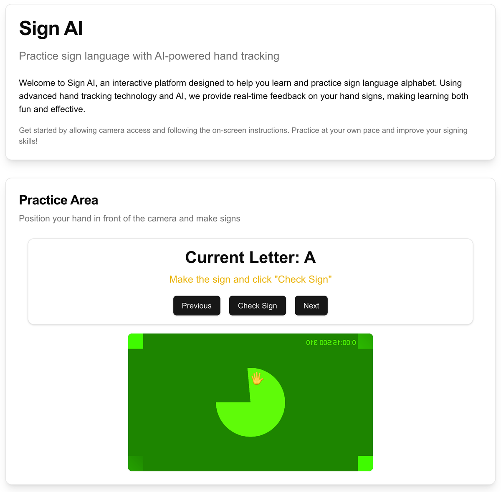

# Sign AI

**Practice the ASL alphabet with your webcam. MediaPipe tracks your hand in the browser, and Gemini's vision model checks whether you're signing the target letter and tells you what to fix. I built it in one afternoon, Dec 6, 2024.**

Built by [Jacob Lopez](https://jacob.com.ai).

<p align="center">
  
</p>

<sub>The app running locally. The camera feed is Chrome's built-in test camera, not a person.</sub>

## How it works

- **Hand tracking in the browser.** MediaPipe's hand landmarker runs on the webcam feed locally, using WebAssembly and WebGL. Video only leaves the device when you ask for a check. See [`hand-tracker.tsx`](components/hand-tracking/hand-tracker.tsx).
- **A vision model as the grader.** "Check Sign" sends one frame and the target letter to [`/api/check-sign`](app/api/check-sign/route.ts). There, Gemini Flash (`gemini-3.8-flash`; it shipped on 1.5 Flash) judges the sign against the ASL alphabet only, not BSL or Auslan. It returns JSON with a match, a confidence score, and specific feedback.
- **Hands-free navigation.** Your palm moves a cursor and a fist clicks. The OK sign right-clicks, the ASL "I love you" handshape highlights, and holding your palm near the edge of the screen scrolls. See [`cursor-control.tsx`](components/hand-tracking/cursor-control.tsx).

## Run it

```bash
pnpm install
echo "GOOGLE_AI_KEY=your-gemini-key" > .env.local   # optional: GEMINI_MODEL=another-current-model
pnpm dev
```

## What changed for the public release

This is the original history: 14 commits made between noon and 3 p.m. on Dec 6, 2024. Before publishing in October 2026, I made these changes:

- I upgraded Next.js from 15.0.4 to 15.0.8 to pick up the React Server Components security fixes.
- I removed an unused component that read a Gemini key on the client. It was never rendered, but it would have exposed the key if anyone had used it.
- Gemini 1.5 Flash has since been retired, so the grader now defaults to `gemini-3.8-flash`. Set `GEMINI_MODEL` to pin another current model.

## More

Later accessibility work: [xAccessibility](https://github.com/woodbeary/grok-access), which flags sarcasm and idioms in live conversation for Deaf and hard-of-hearing people (xAI hackathon, Dec 2025). My main project is [TXT CLAW → Rotary](https://github.com/woodbeary/rotary).
